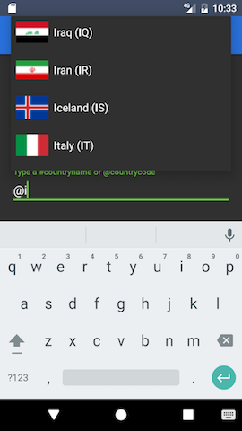
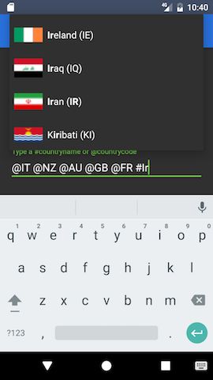
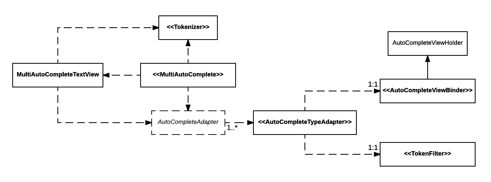

# Android MultiAutoComplete

[  ](https://bintray.com/teamwork/com.teamwork/android-multiautocomplete/_latestVersion)

A library that provides a layer of abstraction over the Android `MultiAutoCompleteTextView` standard component,
to simplify showing a drop down menu with suggestions for auto complete when the user is typing into an editable text view.

* Built-in support for multiple data types in the same `MultiAutoCompleteTextView`
* Built-in support for different token types: prefix handles (i.e. _@johndoe_) or comma-separated values
* Built-in support for a simple image/text data type with standard layout
* Fully customizable item layout management, view binders and view holders included
* Fully customizable data filtering strategy and data sorting policies
* Type-specific listeners to detect when a full token is added/removed from the text
* High performance data indexing on a background thread to reduce filtering overhead


&nbsp;&nbsp;&nbsp;

Using **MultiAutoComplete** can be as easy as this:

```java
    List<SimpleItem> itemsList = ...
    MultiAutoComplete autoComplete = MultiAutoComplete.Build.from(itemsList);
    autoComplete.onViewAttached(autoCompleteEditText);
```

### Advantages over using MultiAutoCompleteTextView directly
* No need to write your own `Tokenizer` implementation for handles
* No need to write the drop down ListView adapter boilerplate code
* No need to write a (_thread-safe_) `Filter` subclass for the adapter
* No need to write an adapter composition pattern to support multiple types
* No need to write decorator objects to merge different data types in a single adapter
* Support for the hidden Android API `Filter$Delayer` through reflection (new in _0.2.5_)
* (coming soon) Ability to easily swap between `AutoCompleteTextView` and `MultiAutoCompleteTextView`

## Download
Add dependency via **Gradle**:
```groovy
compile 'com.teamwork:android-multiautocomplete:0.2.5'
```
or **Maven**:
```xml
<dependency>
  <groupId>com.teamwork</groupId>
  <artifactId>android-multiautocomplete</artifactId>
  <version>0.2.5</version>
  <type>pom</type>
</dependency>
```

## Documentation
Javadoc documentation is available here: https://teamwork.github.io/android-multiautocomplete/

### Domain language
To understand how to use the library quickly, keep in mind the definition of those recurring words in the API:

* **Type adapter:** Just like Android adapters (and the Adapter design pattern),
a type adapter is used to display and filter a single data type (also called _model_).
Each model requires a separate type adapter.

* **Token:** A text token is a string that is processed by a filter and recognized as valid for triggering auto completion.
A token can be prefixed by a char **handle** (i.e. _@johndoe_, where '_@_' is the handle) or can be a single word with a
separator (i.e. a space, or a comma).

* **Constraint:** a text constraint is similar to a token, but it's used to filter contents from the type adapters.
If the token has a handle, i.e. _@johndoe_, its constraint will be _johndoe_.

### Components
In order to customize **MultiAutoComplete** to suit your needs, you're going to need to use or implement some or all of these interfaces:
* `MultiAutoComplete`: The main library component, it manages the type adapters and holds a reference to the `MultiAutoCompleteTextView`.
It provides lifecycle methods to attach/detach the view itself.
It holds an "adapter of adapters" internally, with which the presenter can handle multiple data types in the same instance and decide which
adapter to use for filtering depending on what kind of token is being typed in.

To create an instance use one of the static factory methods in `MultiAutoComplete.Builder` or, for full customization,
use the _Builder_ itself:
```java
    MultiAutoComplete autoComplete = new MultiAutoComplete.Builder()
        .tokenizer(tokenizer)
        .addTypeAdapter(typeAdapter1)
        .addTypeAdapter(typeAdapter2)
        .build();
```

* `AutoCompleteTypeAdapter`: A typed adapter, used to provide a layout, data binding and filter options for a single data type.
It holds a _ViewBinder_ and a _TokenFilter_.

To create an instance use the static factory method `AutoCompleteTypeAdapter.Build.from()`:
```java
        AutoCompleteViewBinder<MyDataType> viewBinder = new MyViewBinder();
        TokenFilter<MyDataType> tokenFilter = new MyTokenFilter();
        AutoCompleteTypeAdapter<MyDataType> myTypeAdapter = AutoCompleteTypeAdapter.Build.from(viewBinder, tokenFilter);
```

To set (or replace) the items for the type adapter, even after `MultiAutoComplete` was created, just call:
```java
        List<MyDataType> myItemsList = ...
        myTypeAdapter.setItems(myItemsList);
```

* `AutoCompleteViewBinder`: A typed component used by a type adapter to bind the data from an item to the appropriate layout.
`SimpleItemViewBinder` is a concrete implementation provided for the `SimpleItem` data type.

* `TokenFilter`: A typed component used by a type adapter that takes care of the filtering strategy for the adapter elements.
It also determines whether the type adapter supports the text token that's being currently typed in. Concrete implementations
for basic usage are `HandleTokenFilter`, which support a single handle prefix (like '_@_'), and `SimpleTokenFilter`, which just
matches any token. Both filter items by matching the current text constraint with the value returned by the item's `toString()` method.

* `Tokenizer`: Defined by the `MultiAutoCompleteTextView.Tokenizer` interface (see [javadoc](https://developer.android.com/reference/android/widget/MultiAutoCompleteTextView.Tokenizer.html)),
a tokenizer is used by a `MultiAutoCompleteTextView` to detect the beginning and ending of a token within a text sequence.
Using `PrefixTokenizer` allows you to match all tokens with a handle which are supported by the type adapters you provide:
```java
        MultiAutoCompleteTextView.Tokenizer tokenizer = new PrefixTokenizer('@',':');
```
Alternatively, you can use the Android built-in `MultiAutoCompleteTextView.CommaTokenizer` (see [javadoc](https://developer.android.com/reference/android/widget/MultiAutoCompleteTextView.CommaTokenizer.html)) to detect comma-separated words
or write your own `Tokenizer` for full customization of the token detection, including which characters and separators to support.

#### Class diagram


### Demo App
The module `demo` contains simple usage examples of **MultiAutoComplete**.
Pull the source code and run the app to check it out.

## License

    Copyright 2017 Teamwork.com

    Licensed under the Apache License, Version 2.0 (the "License");
    you may not use this file except in compliance with the License.
    You may obtain a copy of the License at

        http://www.apache.org/licenses/LICENSE-2.0

    Unless required by applicable law or agreed to in writing, software
    distributed under the License is distributed on an "AS IS" BASIS,
    WITHOUT WARRANTIES OR CONDITIONS OF ANY KIND, either express or implied.
    See the License for the specific language governing permissions and
    limitations under the License.
